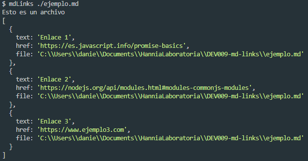
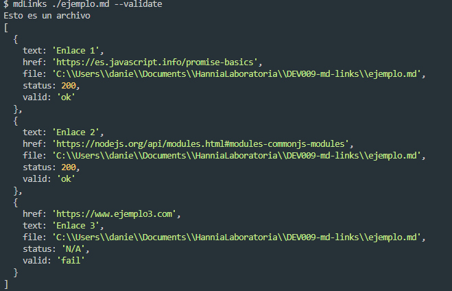
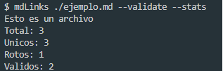
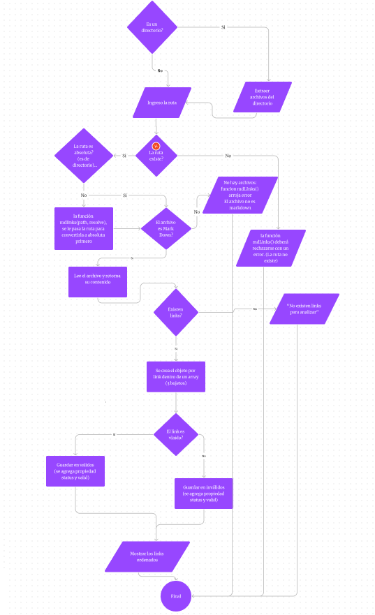

# mdLinks

## Índice

* [1. Descripción](#1-Descripción)
* [2. Sobre el proyecto](#2-Sobre-el-proyecto)
* [3. Instalación](#3-Instalación)
* [4. Guía de uso](#4-Guía-de-uso)
* [5. Proceso del proyecto](#5-Planificación-del-proyecto)

***

## 1. Descripción

Los archivos [Markdown](https://es.wikipedia.org/wiki/Markdown)  normalmente contienen links (vínculos/ligas) que muchas veces están rotos o ya no son válidos y eso puede complicar el uso de la información. 

mdLinks es una herramienta de línea de comandos que te permite verificar y analizar enlaces en archivos [Markdown](https://es.wikipedia.org/wiki/Markdown).

## 2. Sobre el Proyecto 

Haciendo uso de Node.js se ha desarrollado una herramienta que nos permite analizar los links dentro de los archivos [Markdown](https://es.wikipedia.org/wiki/Markdown) ya sea de un directorio o un archivo derectamente. 


Esta librería
está disponible de dos formas: como un módulo publicado en GitHub, que las
usuarias podrán instalar e importar en otros proyectos, y como una interfaz
de línea de comandos (CLI) que permitirá utilizar la librería directamente
desde el terminal.

## 3. Instalación

Para instalar mdLinks, ejecuta el siguiente comando en tu terminal:

```bash
npm install mdlinks
```

## 4. Guía de uso
```bash
mdlinks <Ruta-del-archivo-que-deseas-analizar> [--validate] [--stats]
```
* Despues de `mdLinks` pasa la ruta del directorio o archivo que sera analizado.

* `--validate`: Opción para validar los enlaces encontrados (opcional).

* `--stats`: Opción para mostrar estadísticas sobre los enlaces (opcional).

## Ejemplos de Uso
- Analizar enlaces en un archivo Markdown:
```shell
mdlinks example.md
```

- Analizar enlaces en un directorio y validarlos:
```shell
mdlinks ./docs --validate
```


Analizar enlaces en un directorio, validarlos y mostrar estadísticas:
```shell
mdlinks ./docs --validate --stats
```

## Resultados
Para cada enlace encontrado, mdLinks mostrará el texto del enlace, la URL y el archivo en el que se encontró.
Si se usa la opción --validate, mdLinks también mostrará el estado de validez de cada enlace.

## 5. Proceso del proyecto
 
Para este proyecto se ultilizo el siguiente Diagrama de Flujo.

